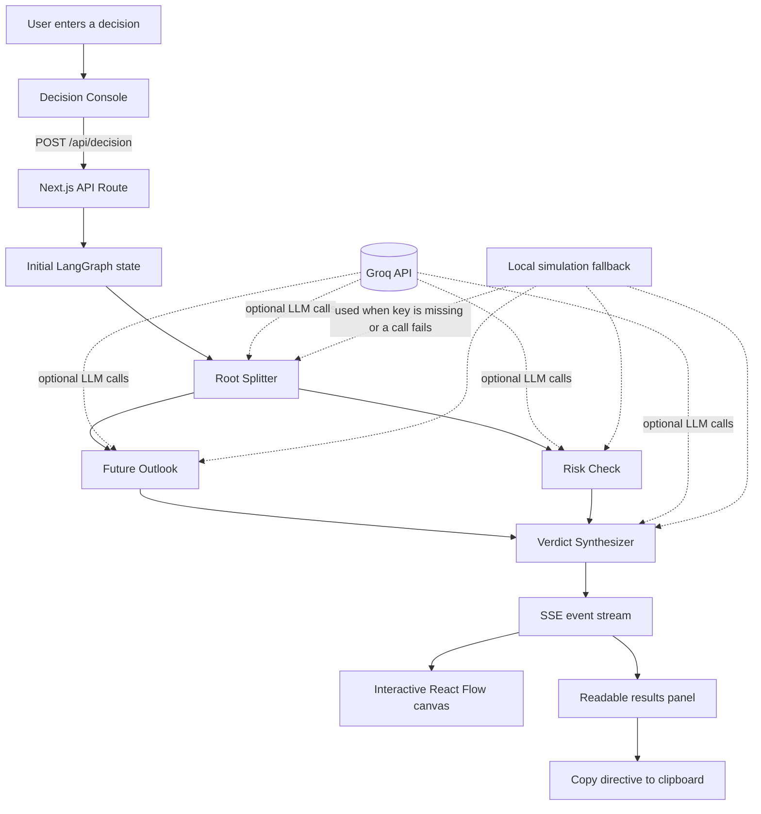

<div align="center">

# Quantum Decision

### Turn a difficult choice into two clear perspectives and one practical next step.

<p>

  
  
  
  
  
  
</p>

<p>
  <strong>Decision Forge</strong> is a visual AI decision tool built for comparing the future upside of a choice with its practical risks.
</p>

</div>

---

## What It Does

Write a real decision, such as a career move, a technical rewrite, or a relocation choice. Quantum Decision sends it through a small graph of AI agents:

- **Root Splitter** turns the dilemma into two contrasting options.
- **Future Outlook** imagines what life may feel like six months later.
- **Risk Check** looks for hidden costs, failure modes, and hard-to-reverse choices.
- **Verdict Synthesizer** compares both views and gives a recommendation with a concrete next step.

The graph updates live while it runs. You can also drag the nodes around the canvas to arrange the view.

## Architecture



### Request Flow

1. The browser sends the decision and optional `apiKey` to `/api/decision`.
2. The API route creates the LangGraph state and starts the graph.
3. Each graph node calls Groq when a key is available.
4. The route streams node status and result events back over Server-Sent Events.
5. The UI updates the canvas, live pipeline, and final result as events arrive.

## Tech Stack

| Area | Tools |
| --- | --- |
| App | Next.js App Router, React, TypeScript |
| AI workflow | LangGraph.js, LangChain Core |
| Model provider | Groq with LLaMA-compatible chat models |
| Visualization | React Flow |
| Styling | Tailwind CSS and custom CSS tokens |
| Transport | Server-Sent Events (SSE) |

## Run Locally

### Requirements

- Node.js 20 or newer
- npm
- A Groq API key for live model responses

### Install and start

```bash
cd quantum-decision
npm install
npm run dev
```

Open [http://localhost:3000](http://localhost:3000).

### Available commands

```bash
npm run dev      # Start the development server
npm run build    # Create a production build
npm run start    # Start the production server
npm run lint     # Run ESLint
npx tsc --noEmit # Check TypeScript types
```

## Add a Groq API Key

You can provide the key in either of these ways:

### Option 1: Use the app

1. Open **Add Groq API Key** in the decision console.
2. Enter your key.
3. Click **Save Key**.
4. Run a decision.

The key is stored in the browser's local storage and sent only with the decision request.

### Option 2: Use `.env.local`

Create `quantum-decision/.env.local`:

```env
GROQ_API_KEY=your_groq_api_key_here
```

Restart the development server after changing environment variables. Never commit `.env.local` or expose the key in client-side code.

> Without a key, the app still runs using local simulated responses so the graph and UI can be tested.

## Project Layout

```text
quantum-decision/
├── src/app/
│   ├── api/decision/route.ts       # SSE endpoint and graph runner
│   ├── globals.css                  # Global theme and React Flow styles
│   └── page.tsx                     # Main screen and stream handling
├── src/components/
│   ├── DecisionConsole.tsx          # Decision input and API key controls
│   ├── DecisionGraph.tsx             # Draggable React Flow canvas
│   ├── AgentStreamInspector.tsx      # Live pipeline status
│   ├── ComparisonVerdictCard.tsx     # Human-readable final results
│   └── nodes/                        # Root, branch, and verdict nodes
├── src/lib/
│   ├── graph.ts                     # LangGraph state and node logic
│   └── types.ts                     # Shared TypeScript types
└── public/                          # Static assets
```

## Safety and Privacy Notes

- API keys are handled on the server when provided through `.env.local`.
- Browser-provided keys are sent in the request body so the server can call Groq.
- Logs report only whether a key exists and never print the key itself.
- The tool provides decision support, not professional financial, legal, medical, or career advice.

## Roadmap Ideas

- Save and compare multiple decision runs.
- Stream partial model text into each active node.
- Add export formats for reports and decision journals.
- Add user-defined agent personas and evaluation criteria.

<div align="center">

Built with Next.js, LangGraph.js, React Flow, and Groq.

</div>
